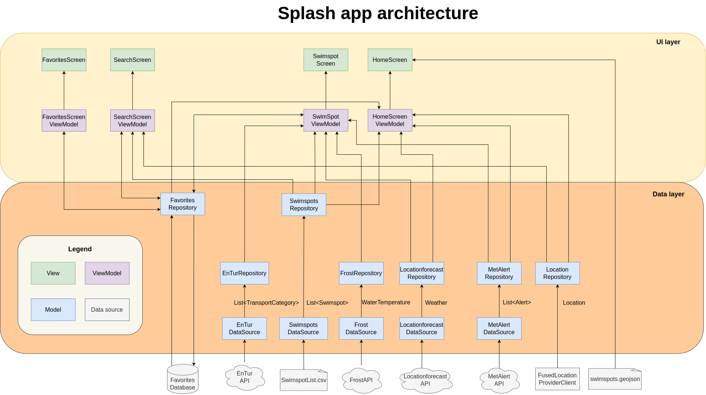

# Splash app architecture 

**Figure 1**: Architecture diagram of Splash app 

## Description

Our app uses a MVVM (Model-View-View Model) architecture. In addition, our app attempts to follow the recommended architecture described by Google in their [recommendations for Android architecture document](https://developer.android.com/topic/architecture/recommendations) (Google for Developers, 2023a). Namely, the following "Strongly Recommended" suggestions have been implemented (those crossed out are not implemented): 

#### Layered architecture 
* Use a clearly defined data layer.
* Use a clearly defined UI layer.
* The data layer should expose application data using a repository.
* Use coroutines and flows.

#### UI layer 
* Follows Unidirectional Data Flow (UDF).
* Use of AAC ViewModels
* Does not send events from the ViewModel to the UI. 
* ~~Use lifecycle-aware UI state collection.~~
	* We do not use `repeatOnLifecycle` or `collectAsStateWithLifecycle`

#### ViewModel 
* ViewModels should be agnostic of the Android lifecycle.
* Use coroutines and flows.
* Use ViewModels at screen level.
* Use plain state holder classes in reusable UI components.

#### Lifecycle 
* ~~Do not override lifecycle methods in Activities or Fragments.~~
	* Methods are overridden in MainActivity 

#### Handle dependencies 
* Use dependency injection.
* ~~Scope to a component when necessary.~~
	* We did not use a dependency container. 

#### Testing 
* ~~Know what to test.~~
* ~~Prefer fakes to mocks.~~ 
* ~~Test StateFlows.~~

Currently, only our data sources have unit tests. 

## Principles 

### Object-oriented principles 

#### Low coupling 

Low coupling is when components interact with each other as little as possible (Smith, 2021). In our architecture, the data layers are completely independent from one other, which achieves low coupling. Each viewmodel is only relevant to one screen, which in turn does not use any other viewmodel. 

The viewmodels and the screens/views often depend on many other repositories, but this was necessary to be able to display the information needed on the screens. 

#### High cohesion 

High cohesion is when elements in a certain module such as a file are related to each other (Smith, 2021). This was achieved by having repositories and viewmodels that have specific tasks. 

Bigger files, such as the HomeScreen, did have many different types of components and logic (for example, the Mapbox component and the reverse geocoding component). These could have been separated out to other files and functions to achieve better cohesion. 

### Model-View-View Model (MVVM)

MVVM involves three layers of abstraction, that is a Model layer, a ViewModel layer, and a View layer. These help separate the UI components from the business and application logic (Microsoft, 2022). Our app mostly follows this structure (with one exception where a raw file is accessed by the home screen directly), as shown in Figure 1. 

### Unidirectional Data Flow (UDF)

In the UDF pattern, state flows in only one direction, and events (that modify state) flow in another direction (Google for Developers, 2023b). In our architecture, this is achieved by having the viewmodels, which store the state variables, and the views/screens, which is where events occur. The screens take the state from the viewmodels, and the screens register when events occur, which satisfies UDF. 

## Maintenance and further development

### Dependencies 

Some of the dependencies have special requirements. These include: 
* Accompanist library: Library version needs to match to the corresponding Jetpack Compose library. This means that if the Jetpack Compose library is changed, the Accompanist library must also change. Different versions may or may not support the same functionality. 
* Mapbox: Mapbox requires API keys linked to an account to function. The current keys will be deactivated after some time. The keys are stored in the files: 
	*  Secret token: `gradle.properties` 
	*  Access token: 
		*  `app/src/main/res/values/developer-config.xml`
		*  `app/src/main/res/values/strings.xml`

### Missing functionality 

The following features have not been implemented: 
* Home button on map: User is meant to zoom to a home location on a map. If not defined or if it is the first time the user has opened the app, the button should request the user to select a "home" location. 
* Filtering on search screen: The "Faciliteter" and "Badeplass" filters in the search screen do not work. Currently this information is not found in the swimspots files, but they are available on the Oslo kommune website (Oslo kommune, n.d.). 
* No GPS permissions/access: The GPS button in the home screen does not respond if the user clicks on it when there is no GPS connection. A snackbar with a message should appear when this happens. 

## Included technologies 

Splash uses the following libraries and technologies: 

* Jetpack Compose 
	* Used to create UI components 
* Material Design 3
	* Used to standardize fonts and styles  
* Mapbox Android SDK and Temporary Geocoding API
	* Used to display map and associated data like user location and swimspot locations 
	* Used to get name of current location (in map weather dialog)
* KTor
	* Used to make HTTP requests from APIs 
* JUnit 
	* Used for unit tests of the data sources 
* Room 
	* Used to store and manage favorite swimspots in a SQLite database 
* Accompanist 
	* Used to manage location permissions 
* Gradle
	* Used to manage the app builds in Android Studio 

## API level

The minimum API level required for the app is 26. This means that approximately 95% of Android devices can use the app (Belinski, 2024). Originally, we had chosen API level 24, since it covered 97% of devices. However, we wanted to use a datetime library (Instant) which required API 26. 

## Sources 

  Belinski, E. (2024, April 27). Android API Levels. https://apilevels.com/
  
  Google for Developers. (2023a, July 12). Recommendations for Android architecture. Recommendations for Android Architecture | Android Developers. https://developer.android.com/topic/architecture/recommendations
  
  Google for Developers. (2023b, December 12). Guide to app architecture. Guide to App Architecture | Android Developers. https://developer.android.com/topic/architecture#recommended-app-arch
  
  Microsoft. (2022, April 11). Model-View-ViewModel (MVVM). https://learn.microsoft.com/en-us/dotnet/architecture/maui/mvvm
  
  Oslo kommune. (n.d.). Badeplasser og temperaturer - Tur og friluftsliv. Oslo kommune. Retrieved May 7, 2024, from https://www.oslo.kommune.no/natur-kultur-og-fritid/tur-og-friluftsliv/badeplasser-og-temperaturer/
  
  Smith, K. (2021, November 21). High Cohesion, Loose Coupling. https://kevinsmith.io/high-cohesion-loose-coupling/

