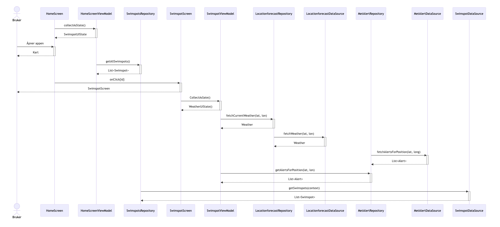
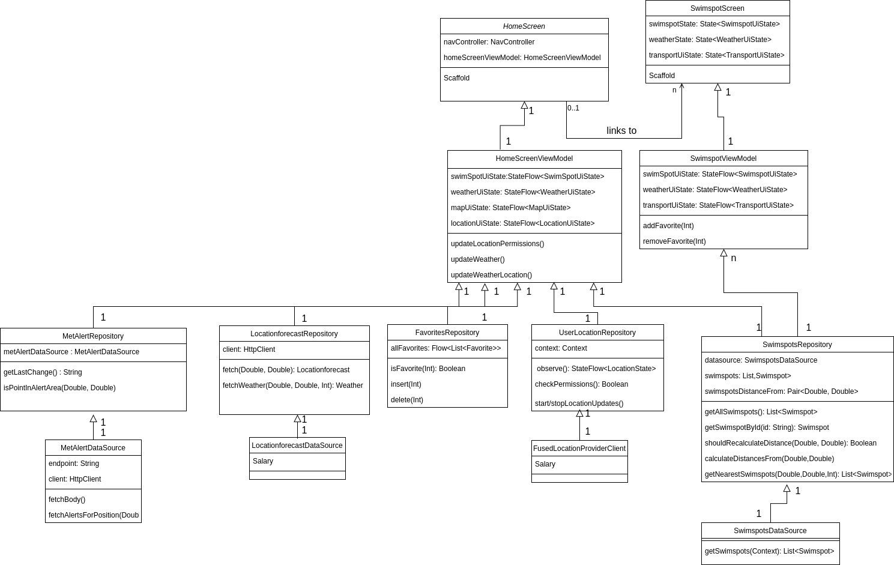

# Appmodelering 

## Use case-diagram 

.png)

Dette er usecase diagram som er basert på et av våre funksjonelle krav. Vi valgte et krav som beskriver formålet med appen og som tar i bruk de fleste API - ene. 

Dette er det samme usecase diagrammet med et eksempel på en alternativ flyt. Her har vi valgt om brukeren vil legge til en badeplass til favoritter.  

## Sekvensdiagram 

Sekvensdiagrammet vårt viser hvordan hver av klassene interagerer med hverandre og hva som blir henta ut fra de ulike API - ene. Den viser også de spesifikke funksjonene som blir henta ut i forhold til vårt usecase. 

## Aktivitetsdiagram

Aktivitetsdiagrammet vårt viser de ulike aktivitetene som en bruker gjør for å finne informasjon om en badeplass. Den viser også en alternativ flyt som viser hva som skjer om brukeren ikke har tilgang til nett på appen. 

## Klassediagram 

Dette klassediagram viser klassene som brukes for sekvensdiagrammet ovenfor. 
